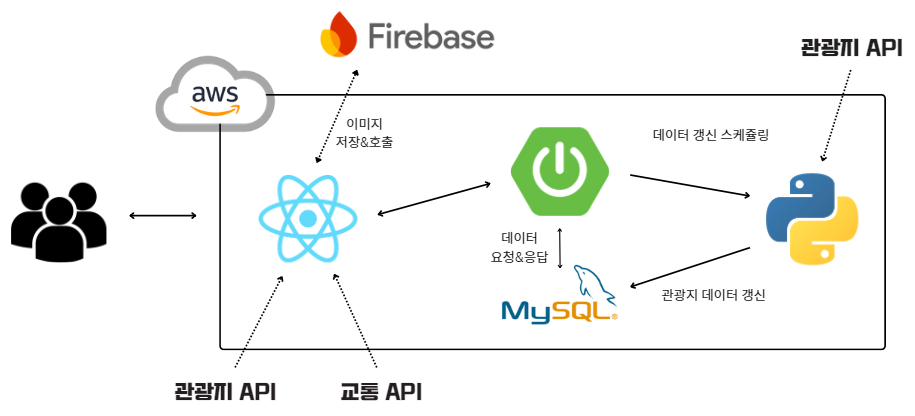

    

#  Plan4Land

<h3 style="border-bottom: none;"> 국내 관광지 검색 및 여행 플래닝 작성 플랫폼</h3>

- 관광지, 맛집, 숙소 정보를 한 곳에서 검색 가능하도록 지원

- 사용자들이 함께 여행 계획을 세울 수 있도록 지원  

- 다른 사람들의 여행 계획을 참고하여 나만의 여행을 쉽게 구상  

- 기차 및 고속버스 운행 정보를 실시간으로 확인 가능

<h3 style="border-bottom: none;">🔗 URL</h3>

- [Plan4Land 홈페이지 바로가기](https://plan4land.store)

- [**Front** Git Code 바로가기](https://github.com/Plan4Land/P4L_Front)

- [**Back** Git Code 바로가기](https://github.com/Plan4Land/P4L_Back)

- [**Python API** Git Code 바로가기](https://github.com/Plan4Land/P4L_API)

- [**APP** Git Code 바로가기](https://github.com/Plan4Land/P4L_App)

 

<!-- ## 목차

[사용 기술 및 개발 환경](#사용-기술-및-개발-환경)

  -->

## 🛠️ 사용 기술 및 개발 환경

><h3 style="border-bottom: none;">사용 기술</h3>

- <h3 style="border-bottom: none;">Frontend</h3>

&emsp;&emsp; 

- <h3 style="border-bottom: none;">Backend</h3>

&emsp;&emsp;   

- <h3 style="border-bottom: none;">Database</h3>

&emsp;&emsp; 

- <h3 style="border-bottom: none;">ETC.</h3>

&emsp;&emsp;     

 

><h3 style="border-bottom: none;">개발 환경</h3>

 

## ✨ 주요 기능

><h3 style="border-bottom: none;">관광지</h3>

- 지역, 카테고리별 조회 및 키워드 검색 기능 제공

- 관광지 상세 정보 제공 및 카카오 지도를 통한 위치 확인

- 선택한 관광지를 기준으로 주변 관광지 10개 추천

- 관광지 북마크 기능으로 관심 장소 관리 가능

><h3 style="border-bottom: none;">플래닝</h3>

- 여행 일정을 날짜별로 계획할 수 있는 플래닝 기능

- 다른 유저 초대를 통해 실시간 채팅 및 공동 플래닝 가능

- 날짜별로 카카오맵 API를 활용해 장소를 검색하고 추가하여 세부 계획 수립

- 카카오 지도에서 계획된 장소들의 위치를 한눈에 확인

- 플래닝 북마크 기능으로 관심 플래닝 관리 가능

- 플래닝 공개/비공개 설정으로 보안 관리 가능

><h3 style="border-bottom: none;">교통</h3>

- 열차(KTX, SRT 등) 실시간 운행 정보 조회 (특정 날짜 기준)

- 고속버스 실시간 운행 정보 조회 (특정 날짜 기준)